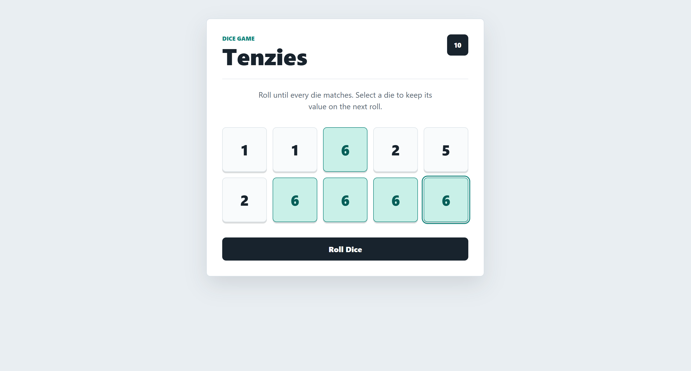

# 🎲 Tenzies

A fun and interactive **Tenzies dice game** built with **React and Vite**.

The objective is simple: **roll until all 10 dice show the same number**. Players can hold individual dice between rolls to strategically work toward a winning combination.

### 🔗 [Live Demo](https://YOUR-USERNAME.github.io/tenzies-react/) | 📂 [Source Code](https://github.com/YOUR-USERNAME/tenzies-react)

## ✨ Features

* 🎲 Roll 10 dice at once
* 🖱️ Hold and unhold individual dice
* 🔄 Held dice remain unchanged between rolls
* 🏆 Automatic win detection
* 🎉 Confetti animation when the game is won
* 🔁 New Game functionality
* ♿ Accessible win-state feedback
* ⚡ Fast development with Vite

## 🛠️ Tech Stack

* **React**
* **JavaScript**
* **Vite**
* **CSS**
* **Nanoid** – unique dice IDs
* **React Confetti** – win animation

## 🧠 React Concepts Used

This project helped me practice:

* `useState` for managing game state
* `useEffect` for responding to the win state
* `useRef` for managing button focus
* Component-based architecture
* Props and event handling
* Conditional rendering
* Array methods such as `map()` and `every()`
* Dynamic state updates
* Accessibility with `aria-live`

## 🎮 How to Play

1. Click **Roll** to roll all available dice.
2. Click any die to **hold** it.
3. Roll again to change only the unheld dice.
4. Continue holding matching dice while rolling the remaining dice.
5. Get all 10 dice to show the same number to win.
6. Click **New Game** to start another round.

## 🚀 Getting Started

### Prerequisites

Make sure you have **Node.js** and **npm** installed.

### Installation

Clone the repository:

```bash
git clone https://github.com/furqhan24/tenzies-react.git
```

Navigate to the project:

```bash
cd tenzies-react
```

Install dependencies:

```bash
npm install
```

Start the development server:

```bash
npm run dev
```

Open the local development URL shown in your terminal.

## 📸 Preview



## 🔮 Future Improvements

* Add a roll counter
* Add a timer
* Track best scores using `localStorage`
* Add sound effects
* Add difficulty/game modes
* Improve mobile responsiveness

## 📚 Learning

This project was built as part of my journey learning **React**, with a focus on understanding state management, reusable components, event handling, and dynamic UI updates.

---


